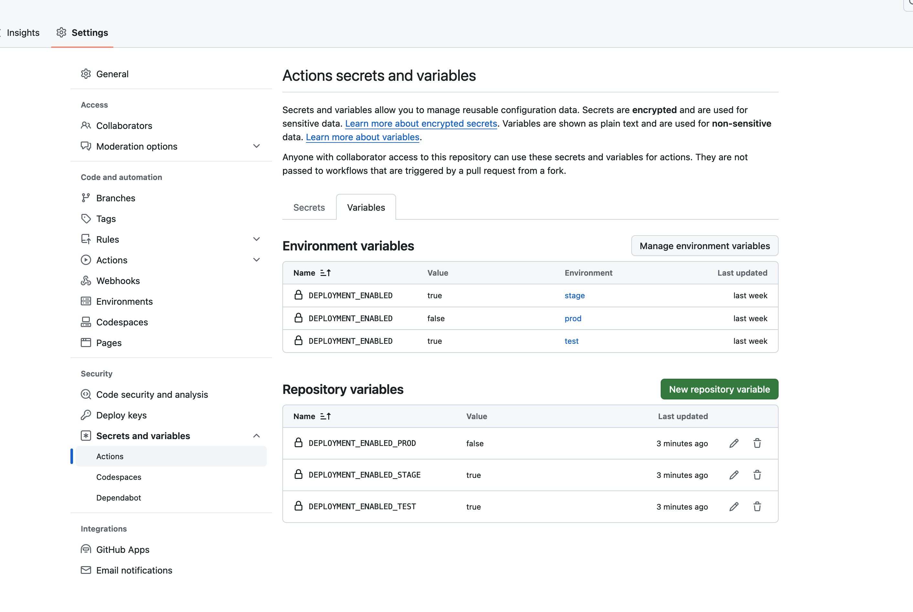

### Option 1: Using repository variables
Pausing a pipeline step can be achieved by setting "Repository Variables" as can be seen on the screenshot below.

They can then be used in any `if`-statement of a job in a GitHub Action, as demonstrated in [this workflow](.github/workflows/deployment-with-repo-vars.yml).

### Option 2: Using environment-level variables
Second option is to use environment-level variables as also shown on the screenshot below.

They should also be useable within any workflow, as demonstrated in [this workflow](.github/workflows/deployment.yml).

**Note:** This approach is currently not working as expected, see discussion in https://github.com/actions/runner/issues/2472.

